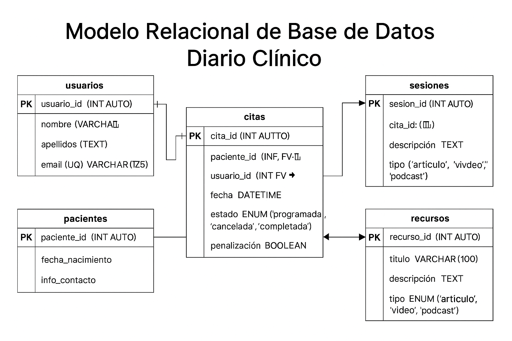

# Diario Clínico

## Información de Modelo Entidad Relación

### Entidades Principales 

#### Usuario
-       id_usuario (PK)
-       nombre
-       correo
-       contraseña
-       fecha_registro
-       activo

#### Psicólogo
-       id_psicologo (PK)
-       nombre
-       correo
-       especialidad
-       cedula_profesional
-       contraseña

#### Cita
-       id_cita (PK)
-       id_usuario (FK)
-       id_psicologo (FK)
-       fecha_hora
-       estado
-       tipo_cita
-       fecha_creacion

#### Sesión
-       id_sesion (PK)
-       id_cita (FK)
-       notas_clinicas
-       recomendaciones
-       avance
-       documentos_adjuntos

#### Consentimiento
-       id_consentimiento (PK)
-       id_usuario (FK)
-       fecha_firma
-       consentimiento_aceptado

#### Penalización
-       id_penalizacion (PK)
-       id_usuario (FK)
-       motivo
-       fecha
-       activo

## Diagrama Relacional

## Relaciones Existentes entre Entidades

- Un Usuario puede tener muchas Citas.
- Un Psicólogo puede tener muchas Citas.
- Una Cita genera una única Sesión.
- Un Usuario debe aceptar un único Consentimiento.
- Un Usuario puede tener varias Penalizaciones.

## Tablas Relacionales 

## Tabla: usuarios

| Campo         | Tipo de Dato     | Clave     |
|---------------|------------------|-----------|
| usuario_id    | INT AUTO         | PK        |
| nombre        | VARCHAR(50)      |           |
| apellidos     | VARCHAR(50)      |           |
| email         | VARCHAR(100)     | UQ        |
| contraseña    | VARCHAR(255)     |           |
| fecha_registro| DATETIME         |           |

---

## Tabla: citas

| Campo         | Tipo de Dato     | Clave     |
|---------------|------------------|-----------|
| cita_id       | INT AUTO         | PK        |
| usuario_id    | INT              | FK        |
| fecha_cita    | DATETIME         |           |
| motivo        | TEXT             |           |
| estado        | VARCHAR(30)      | (Agendada, Cancelada, Finalizada) |

---

## Tabla: sesiones

| Campo          | Tipo de Dato     | Clave     |
|----------------|------------------|-----------|
| sesion_id      | INT AUTO         | PK        |
| cita_id        | INT              | FK        |
| fecha_sesion   | DATETIME         |           |
| notas          | TEXT             |           |
| avance         | TEXT             |           |

---

## Tabla: consentimientos

| Campo             | Tipo de Dato     | Clave     |
|-------------------|------------------|-----------|
| consentimiento_id | INT AUTO         | PK        |
| usuario_id        | INT              | FK        |
| fecha_firma       | DATETIME         |           |
| aceptado          | BOOLEAN          |           |

---

## Tabla: penalizaciones

| Campo             | Tipo de Dato     | Clave     |
|-------------------|------------------|-----------|
| penalizacion_id   | INT AUTO         | PK        |
| usuario_id        | INT              | FK        |
| motivo            | VARCHAR(100)     |           |
| fecha             | DATETIME         |           |
| observaciones     | TEXT             |           |

---

## Relaciones

- `usuarios` → `citas`: 1 a M (un usuario puede tener muchas citas)
- `citas` → `sesiones`: 1 a 1 o 1 a M (una cita puede generar una o más sesiones)
- `usuarios` → `consentimientos`: 1 a 1 (cada usuario tiene un consentimiento)
- `usuarios` → `penalizaciones`: 1 a M (un usuario puede tener varias penalizaciones)